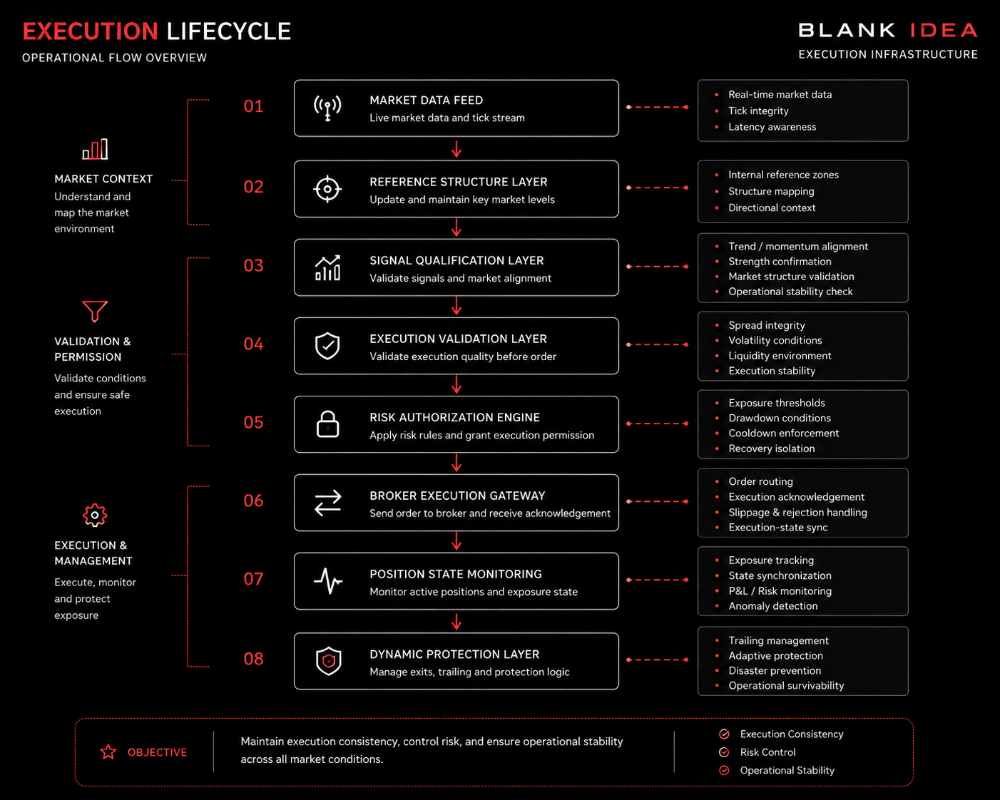
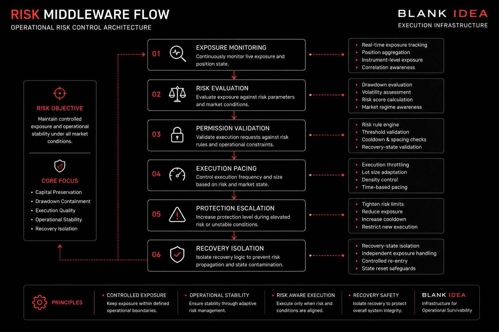
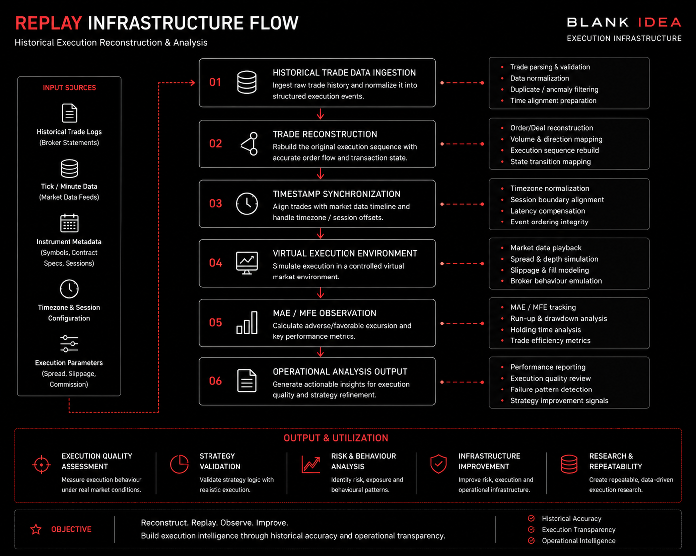

# System Diagrams

Operational architecture and infrastructure flow diagrams related to execution systems, risk middleware and replay infrastructure research.

---

# Execution Lifecycle

The execution lifecycle infrastructure focuses on:
- execution validation
- operational pacing
- exposure awareness
- adaptive protection handling

---

# Risk Middleware Flow

The risk middleware infrastructure focuses on:
- exposure containment
- execution pacing
- protection escalation
- recovery isolation

---

# Replay Infrastructure Flow

The replay infrastructure focuses on:
- historical trade reconstruction
- replay-state synchronization
- MAE / MFE observation
- operational analysis
